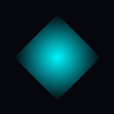

<div align="center">



# Gemini Chat

**A modern AI chat desktop app powered by Google Gemini**

Built with Nuxt 3 · Tauri 2 · TypeScript · Tailwind CSS

[](https://tauri.app)
[](https://nuxt.com)
[](https://vuejs.org)
[](https://www.typescriptlang.org)
[](LICENSE)


</div>

---

## Overview

Gemini Chat is a standalone Windows desktop application that gives you a polished, feature-rich interface for chatting with Google Gemini AI models. It runs entirely client-side — your API key and conversation history stay on your machine, never on a third-party server.

The app is built on [Tauri 2](https://tauri.app) (Rust backend + WebView2 frontend) with a [Nuxt 3](https://nuxt.com) static frontend, styled with a dark cyberpunk aesthetic.

---

## Screenshots

> _Add your own screenshots here_

---

## Features

- **8 Gemini models** — Gemini 3.1 Pro, 3 Flash, 2.5 Pro, 2.5 Flash, 2.0 Flash, 2.0 Flash Lite, 1.5 Pro, 1.5 Flash
- **Streaming responses** — real-time token-by-token output
- **File attachments** — attach images and documents for multimodal queries
- **Persistent conversations** — full history saved locally in localStorage
- **Conversation management** — create, rename (auto-titled), delete conversations
- **Advanced parameters** — temperature, top-P, top-K, max tokens, system prompt
- **Export conversations** — save as Markdown, JSON, or plain text
- **Token usage dashboard** — live token count per conversation
- **Keyboard shortcuts** — `Ctrl+K` new chat, `Ctrl+,` settings, `Ctrl+L` clear, and more
- **Dark native title bar** — Windows 11 DWM dark mode via `DwmSetWindowAttribute`
- **Native ARM64 + x64** — builds for both Windows 11 ARM64 and x64

---

## Tech Stack

| Layer | Technology |
|---|---|
| Desktop shell | Tauri 2 (Rust) |
| Frontend framework | Nuxt 3 (SSG / `ssr: false`) |
| UI language | Vue 3 + TypeScript |
| Styling | Tailwind CSS + custom CSS |
| AI SDK | `@google/generative-ai` |
| Markdown rendering | `marked` |
| Fonts | Syne + Space Mono (Google Fonts) |

---

## Prerequisites

Before building, install the following on your **Windows ARM64 or x64** machine:

### 1. Rust
```powershell
winget install --id Rustlang.Rustup
# Restart terminal, then verify:
rustup --version
```

### 2. Rust build targets
```powershell
# For ARM64 (native on Surface Pro X, Snapdragon laptops, etc.)
rustup target add aarch64-pc-windows-msvc

# For x64 (standard Intel/AMD laptops)
rustup target add x86_64-pc-windows-msvc
```

### 3. Visual Studio Build Tools
Download from: https://visualstudio.microsoft.com/visual-cpp-build-tools/

Select these workloads during install:
- ✅ **Desktop development with C++**

Under **Individual Components**, also add:
- ✅ MSVC v143 — VS 2022 C++ ARM64 build tools (Latest) ← for ARM64
- ✅ MSVC v143 — VS 2022 C++ x64/x86 build tools (Latest) ← for x64

### 4. Node.js
```powershell
winget install OpenJS.NodeJS.LTS
```

### 5. WebView2
Already included in Windows 11. If missing:
https://developer.microsoft.com/en-us/microsoft-edge/webview2/

---

## Getting Started

```powershell
# 1. Clone the repo
git clone https://github.com/yourusername/gemini-chat.git
cd gemini-chat

# 2. Install dependencies
npm install

# 3. Run in development mode (hot reload)
npm run tauri:dev
```

---

## Building

### Windows 11 ARM64 installer
```powershell
npm run tauri:build
```
Output: `src-tauri\target\aarch64-pc-windows-msvc\release\bundle\nsis\Gemini Chat_1.0.0_arm64-setup.exe`

### Windows x64 installer
```powershell
npm run tauri:build:x64
```
Output: `src-tauri\target\x86_64-pc-windows-msvc\release\bundle\nsis\Gemini Chat_1.0.0_x64-setup.exe`

> **Note:** The ARM64 build produces a native binary — no emulation layer, better performance and battery life on ARM devices. The x64 build runs on ARM64 Windows via emulation but is compatible with all standard Windows laptops.

---

## Configuration

### API Key

On first launch, click **SETTINGS** in the sidebar and enter your [Google AI Studio API key](https://aistudio.google.com/apikey).

Your key is stored in `localStorage` inside the WebView2 sandbox on your local machine. It is never transmitted anywhere except directly to the Google Gemini API.

### Optional: Environment variable

If you want to pre-set a default API key at build time, create a `.env` file:
```env
GEMINI_API_KEY=your_key_here
```

---

## Available Models

| Model | API ID | Speed | Notes |
|---|---|---|---|
| Gemini 3.1 Pro | `gemini-3.1-pro-preview` | Moderate | Most powerful, preview |
| Gemini 3 Flash | `gemini-3-flash-preview` | Fast | Frontier-class, preview |
| Gemini 2.5 Pro | `gemini-2.5-pro` | Moderate | Best reasoning, stable |
| Gemini 2.5 Flash | `gemini-2.5-flash` | Fast | Best price-performance ⭐ default |
| Gemini 2.0 Flash | `gemini-2.0-flash` | Fast | Stable multimodal |
| Gemini 2.0 Flash Lite | `gemini-2.0-flash-lite` | Fastest | High volume |
| Gemini 1.5 Pro | `gemini-1.5-pro` | Moderate | 2M token context |
| Gemini 1.5 Flash | `gemini-1.5-flash` | Fast | Reliable and fast |

---

## Project Structure

```
gemini-chat/
├── pages/
│   └── index.vue                  # Main chat UI
├── components/
│   ├── ChatMessage.vue            # Message renderer (Markdown + code)
│   ├── ChatSidebar.vue            # Conversation list
│   ├── SettingsModal.vue          # API key + model parameters
│   ├── FileAttachment.vue         # File/image attachment handling
│   ├── TokenDashboard.vue         # Token usage analytics
│   ├── ExportMenu.vue             # Export conversations
│   └── KeyboardShortcutsHelp.vue  # Shortcuts overlay
├── composables/
│   ├── useChat.ts                 # Core state + direct Gemini SDK calls
│   ├── useExport.ts               # Export logic (MD / JSON / text)
│   └── useKeyboardShortcuts.ts    # Global keyboard handler
├── assets/css/
│   └── main.css                   # Global styles + dark theme
├── app.vue                        # Root component
├── nuxt.config.ts                 # ssr:false, Vite externals
├── tailwind.config.js
└── src-tauri/
    ├── src/
    │   └── main.rs                # Tauri setup + Windows dark title bar
    ├── capabilities/
    │   └── main.json              # Tauri v2 permission grants
    ├── icons/                     # App icons (replace with your own)
    ├── Cargo.toml                 # Rust dependencies
    ├── build.rs
    └── tauri.conf.json            # Window config, CSP, bundle targets
```

---

## Keyboard Shortcuts

| Shortcut | Action |
|---|---|
| `Ctrl + K` | New conversation |
| `Ctrl + ,` | Open settings |
| `Ctrl + L` | Clear current conversation |
| `Ctrl + T` | Toggle token dashboard |
| `Ctrl + Shift + F` | Focus message input |
| `Escape` | Close modals |
| `?` | Show keyboard shortcuts |
| `Enter` | Send message |

---

## Architecture Notes

This project takes a **client-only** approach — the Nuxt app is compiled to a static site (`nuxt generate`) and bundled inside the Tauri WebView2 window. There is no Node.js server at runtime.

All Gemini API calls are made directly from the browser context using the `@google/generative-ai` SDK. This means:

- ✅ No backend server to deploy or maintain
- ✅ API key stays on the user's machine
- ✅ Works fully offline except for AI API calls
- ⚠️ API key is stored in WebView2 localStorage (fine for personal use, not for multi-user distribution)

The Windows dark title bar is implemented via the Win32 `DwmSetWindowAttribute` API with `DWMWA_USE_IMMERSIVE_DARK_MODE`, called from Rust in the Tauri `setup()` hook.

---

## Customising the App Icon

The icons in `src-tauri/icons/` are placeholders. To replace them:

1. Create a 1024×1024 PNG of your icon
2. Run: `npx @tauri-apps/cli icon path/to/your-icon.png`
3. This auto-generates all required sizes

---

## Contributing

Pull requests are welcome. For major changes, please open an issue first.

1. Fork the repo
2. Create a feature branch: `git checkout -b feature/my-feature`
3. Commit your changes: `git commit -m 'Add my feature'`
4. Push: `git push origin feature/my-feature`
5. Open a pull request

---

## License

[MIT](LICENSE)

---

## Acknowledgements

- [Google Gemini API](https://ai.google.dev) — AI models
- [Tauri](https://tauri.app) — Desktop app framework
- [Nuxt](https://nuxt.com) — Vue meta-framework
- [Syne](https://fonts.google.com/specimen/Syne) + [Space Mono](https://fonts.google.com/specimen/Space+Mono) — Typography

---

<div align="center">
Made with Nuxt 3 + Tauri 2
</div>
